# Clip Lab Architecture

Clip Lab is a pipeline-oriented monorepo. The goal is to make each stage replaceable while keeping a
single end-to-end path from input video to rendered short-form clips.

## System Flow

```mermaid
flowchart LR
  Input["URL or uploaded video"] --> Ingest["Ingest"]
  Ingest --> Audio["Audio extraction"]
  Audio --> Transcription["Transcription provider"]
  Transcription --> Transcript["Normalized transcript"]
  Ingest --> Scenes["Scene detection"]
  Transcript --> Generator["Clip generator"]
  Scenes --> Generator
  Generator --> Boundaries["Word timestamp boundary refinement"]
  Boundaries --> Critic["Critic/editor pass"]
  Critic --> Packaging["Packaging metadata pass"]
  Packaging --> Cut["FFmpeg cut"]
  Cut --> Reframe["Vertical reframe"]
  Reframe --> Render["Remotion render"]
  Transcript --> Render
  Render --> Export["MP4 clips + metadata"]
```



## App Boundaries

`apps/api` owns the product API, background job state, and CLI entrypoint. It orchestrates packages
but does not contain the transcription, scoring, reframe, or rendering logic itself.

`apps/web` is the focused Clip Lab dashboard. It submits jobs, polls status, and presents clip
metadata without carrying backend business logic into React components.

`apps/renderer` owns the Remotion composition and renderer service. The API talks to it through a
small HTTP client and passes validated render props.

## Package Boundaries

`packages/shared` defines Pydantic contracts:

- `NormalizedTranscript`
- `TranscriptSegment`
- `TranscriptWord`
- `ClipCandidate`
- `ClipCandidateSet`
- `FinalClip`
- `RenderJobSpec`
- `ClipExportMetadata`

`packages/pipeline` owns the end-to-end coordinator and renderer client. It composes package
interfaces, writes the output contract, and creates `export.zip`.

`packages/transcription` defines the provider-agnostic transcription interface. WhisperX is the
first implementation. The adapter normalizes WhisperX output into the shared transcript contract
and keeps diarization optional.

API imports must not import WhisperX or other heavy provider stacks. Provider implementations are
loaded lazily through `create_transcription_provider()` only when transcription is actually invoked.

`packages/clip_intelligence` owns clip selection:

- generator pass
- optional model-provider interface
- deterministic fallback scoring
- critic/editor rejection pass
- packaging metadata pass
- word-level boundary refinement

The scoring model explicitly considers hook strength, self-contained context, payoff, surprise,
conflict, emotion, contrarian value, tactical value, quotability, retention, platform fit, and clean
boundaries. The critic rejects clips that are weak, generic, context-dependent, rambling, or badly
bounded.

`packages/video_processing` owns media operations:

- URL/file ingest
- FFmpeg/FFprobe execution
- audio extraction
- scene detection
- source clip cutting
- vertical H.264/AAC reframing

`packages/captions` converts transcript word timings and clip metadata into Remotion props for
animated captions, word highlighting, hook overlays, and effects.

## Provider Interfaces

Transcription providers implement:

```python
class TranscriptionProvider(Protocol):
    name: str

    def transcribe(self, request: TranscriptionRequest) -> NormalizedTranscript:
        ...
```

Clip intelligence model providers implement:

```python
class ClipModelProvider(Protocol):
    name: str

    def generate_json(self, prompt: str, *, purpose: str) -> dict:
        ...
```

Provider output is always schema-validated before the pipeline trusts it.

## Metadata Contract

Each accepted clip exports:

- `id`
- `title`
- `start`
- `end`
- `duration`
- `viral_score`
- `hook_text`
- `hook_sentence`
- `viral_reason`
- `dominant_mechanism`
- `platform_fit`
- `suggested_caption`
- `risk_flags`
- source, vertical, and rendered file paths
- render props path
- ZIP export path at the top level

## Third-Party Strategy

Clip Lab does not vendor upstream application source trees or model weights. Runtime integrations
stay behind first-party interfaces and are installed through package managers or system packages.
WhisperX remains optional and is loaded only inside `packages/transcription`.

Dependency rules:

- do not import heavy provider stacks from API routes
- wrap third-party behavior behind first-party interfaces
- keep stable product behavior in `packages`
- leave heavy optional dependencies behind adapters
- keep generated outputs, downloaded models, and local credentials out of git

## Import Rules

- `apps/api` may import first-party packages and API-local orchestration helpers.
- `apps/api` must not import raw `whisperx` or other heavy provider implementations.
- `packages/transcription/whisperx_adapter.py` is the only first-party Python module that may
  normalize raw WhisperX output.
- Downstream packages consume `NormalizedTranscript`; they must not accept raw WhisperX segment
  dictionaries.
- `apps/renderer` receives validated render props. It does not select clips or inspect raw
  transcripts.

## First End-to-End Path

The current path is:

1. API or CLI receives URL/file source.
2. `ingest_source` downloads/copies the video.
3. FFmpeg extracts mono 16 kHz WAV.
4. WhisperX adapter produces a normalized transcript, unless a transcript JSON is supplied.
5. Scene detection runs with PySceneDetect when available and falls back to one full-video scene.
6. Generator creates candidates and validates them.
7. Boundaries are refined using word timestamps.
8. Critic rejects weak candidates.
9. Packaging pass finalizes title, hook, caption, platform fit, and risk flags.
10. FFmpeg cuts raw clips into `clips/raw/`.
11. FFmpeg reframes to vertical 1080x1920 H.264/AAC into `clips/vertical/`.
12. Remotion props are written into `render_props/`.
13. Remotion receives caption/hook/effects props and renders final MP4s into `clips/rendered/`.
14. `metadata.json`, `transcript.json`, `scenes.json`, clip files, and `export.zip` are written under `output/<job_id>`.
